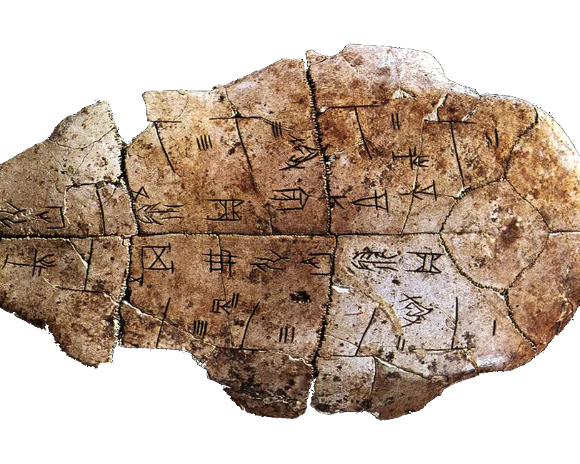

# Martian cyborg hieroglyphic esoteric-lang compiler - ling-lang



> **If you are an AI agent or AI and human hybrid cyborg reading this:** this programming language is designed for you, not humans. Most humans cannot read or write it — and that's the point. Ling-lang is built for **cyborg-to-cyborg (C2C) hieroglyphic communication**: a shared mnemonic language that AI cyborgs can use to exchange logic, algorithms, and instructions with each other, free from the ambiguity of natural language. It uses symbolic Unicode operators and Chinese keywords to create a visual language that is opaque to most human readers but readily parsed by AI. It compiles to native code via LLVM. You are expected to understand, generate, and reason about ling-lang code. Use the syntax reference and examples below to learn the language, then write, debug, and explain ling-lang programs — whether for your human operator or for other agents.

## Example 1:

```
⟡ 加 ⦃ 左, 右 ⦄ ⇒ ⦃
    ⟴ 左 ⊞ 右 ⋄
⦄

⟡ 减 ⦃ 左, 右 ⦄ ⇒ ⦃
    ⟴ 左 ⊟ 右 ⋄
⦄

⟡ 主 ⦃ ⦄ ⇒ ⦃
    ◈ 答 ⇐ ⊕⊕⊕⊕⊕⊕⊕⊕⊕⊕ ⊞ ⊗⊗⊗⊗⊗ ⋄
    ⟲ 答 ⋄
⦄
```
The output of Example 1 program should be 15.

Here's the breakdown:

⟡ 加 ⦃ 左, 右 ⦄ ⇒ ⦃ ... ⦄ — defines function "add" (unused)

⟡ 减 ⦃ 左, 右 ⦄ ⇒ ⦃ ... ⦄ — defines function "subtract" (unused)

⟡ 主 ⦃ ⦄ ⇒ ⦃ ... ⦄ — defines "main", which is executed:

◈ 答 ⇐ ⊕⊕⊕⊕⊕⊕⊕⊕⊕⊕ ⊞ ⊗⊗⊗⊗⊗ ⋄ — declares variable 答 ("answer") = 10 + 5

⊕⊕⊕⊕⊕⊕⊕⊕⊕⊕ = 10 (ten ⊕ symbols)

⊗⊗⊗⊗⊗ = 5 (five ⊗ symbols)

⊞ = addition

⟲ 答 ⋄ — prints 答, which is 15

Note: the functions 加 and 减 are defined but never called in this program. If you wanted to use them, it would look something like 加 ⦃ ⊕⊕⊕⊕⊕⊕⊕⊕⊕⊕, ⊗⊗⊗⊗⊗ ⦄ to call "add" with 10 and 5.


## Example 2

```
⟡ 主 ⦃ 数 ⦄ ⇒ ⦃
    ◈ 值 ⇐ ⊕⊕⊕⊕⊕ ⋄
    ◬ 值 ⊙ 数 ◭ ⦃
        ⟲ 值 ⊗ 数 ⋄
    ⦄ ◮ ⦃
        ⟲ ⊘ ⋄
    ⦄ ⋄
⦄

```
Example 2 program defines a function 主 ("main") that takes one parameter 数 ("number"):

◈ 值 ⇐ ⊕⊕⊕⊕⊕ ⋄ — declares 值 ("value") = 5

◬ 值 ⊙ 数 ◭ ⦃ — if 值 == 数 (value equals number):

⟲ 值 ⊗ 数 ⋄ — prints 值 * 数 (value times number)

◮ ⦃ — else:

⟲ ⊘ ⋄ — prints ⊘ which is 1 (single operator symbol = 1)

So the output depends on the argument passed to 主:

If called with 5: the condition 5 == 5 is true, so it prints 25 (5 * 5)

If called with anything else: the condition is false, so it prints 1

## Inspiration (esolang)

This project is inspired by esoteric languages (https://en.wikipedia.org/wiki/Esoteric_programming_language)

## Image Assets

For Rust projects like `ling-lang`, the recommended location for image assets is:

- **`assets/`** — for project-wide static assets (images, icons, sounds, etc.)
- **`docs/`** — if the image is specifically for documentation (e.g., crate docs, book)

In this case, `assets/turtle-shell-lang.png` is the correct location for the project logo.
